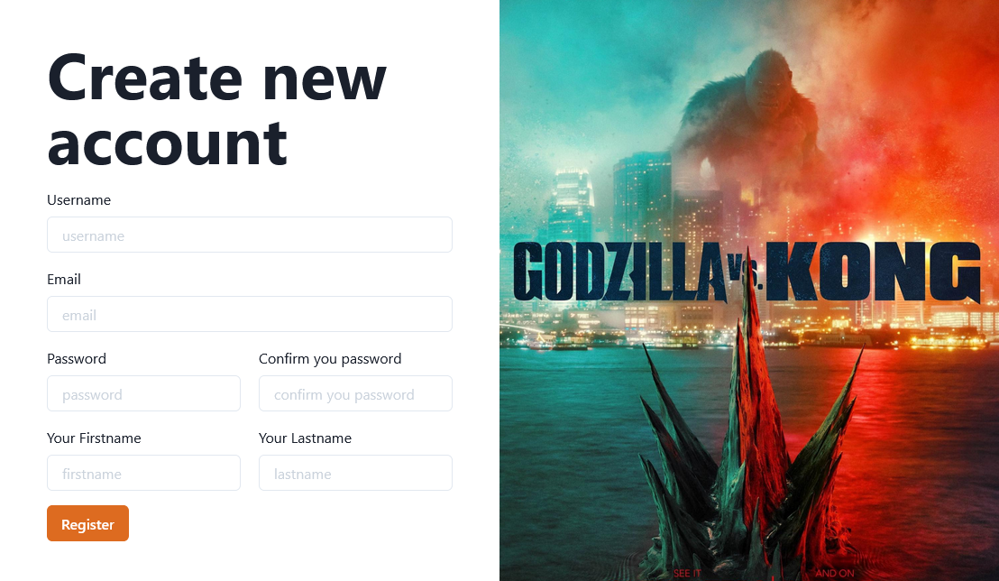
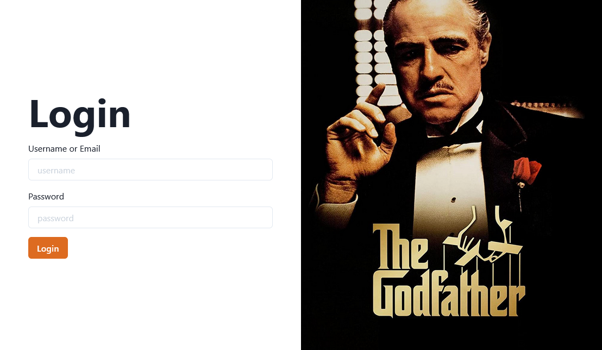
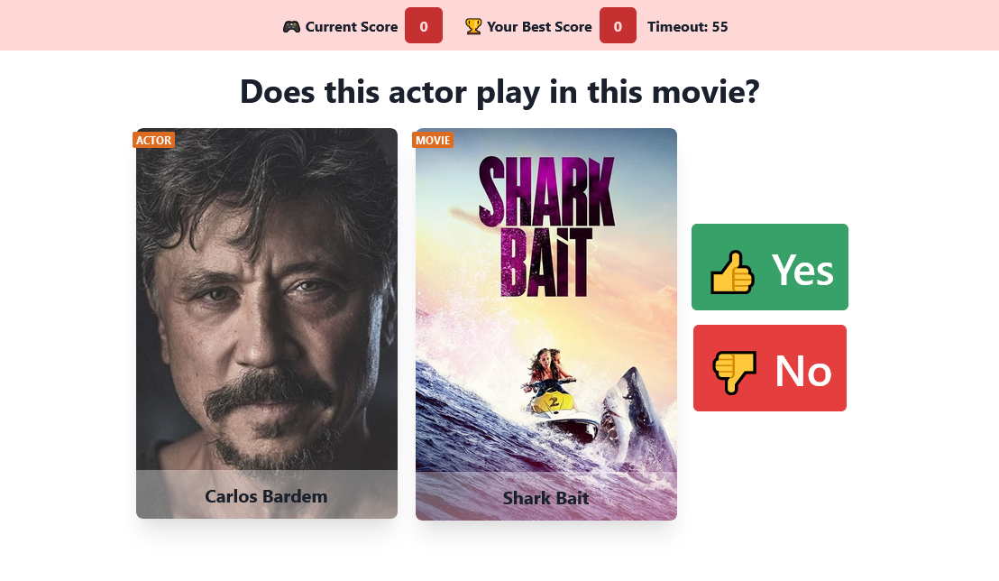

# ZeMovieQuiz

A simple movie game created with a backend and a frontend designed with modern TypeScript tools.
The main source code is provided by this [repository](https://github.com/Valentino-Houessou/typescript-fullstack-starter/tree/develop#docs)

## Screenshots

## Tools
### overall

- [typescript](https://www.typescriptlang.org/)
- [graphql](https://graphql.org/)
- [docker](https://www.docker.com/)
- [docker-compose](https://docs.docker.com/compose/)
- [Ben Awad](https://www.youtube.com/watch?v=I6ypD7qv3Z8)

### front

- [Next Js](https://nextjs.org/)
- [urql](https://formidable.com/open-source/urql/)
- [graphql-codegen](https://www.graphql-code-generator.com/)
- [Chakra UI](https://chakra-ui.com/)
- [Formik](https://formik.org/)

### back

- [express](https://expressjs.com/)
- [Apollo server](https://www.apollographql.com/docs/apollo-server/)
- [type-graphql](https://typegraphql.com/)
- [Typeorm](https://typeorm.io/)

## Requirements

you need the followings tool installed in your environment

- docker
- docker-compose
- node `16.13.1` and bigger
- yarn

## Set up

### Server

In the `server` directory:

- create `dbdata` directory. It is the volume that will be use by Postgres
- create `dist` directory
- rename `.env.exemple.development` to `.env.development` and provide value to `TMDB_API_KEY`
- rename `.env.exemple.database` to `.env.database`
- rename `.env.exemple.redis` to `.env.redis`
- run `yarn`
- run `yarn build`

The environment variables in `.env.database` is used to create Postgre Database, make sure it have the same values within `.env.development` file, according to the table below
| `.env.database` | `.env.development`|
|---|----|
| `POSTGRES_DB` | `DB_DATABASE`
| `POSTGRES_USER` | `DB_USER`
| `POSTGRES_PASSWORD` | `DB_PASSWORD`

The `DB_HOST` variable in `.env.developement` file must be the name of postgree service in  `docker-compose.yml` file at the root directory of the project. The default value is `starter-db`.

The `.env.redis` file contain environment variables for the redis server. Make sure the variable `REDIS_PASSWORD` in `.env.redis` file have the same value with the variable `REDIS_PASSWORD` in `.env.development`

The `REDIS_HOST` variable in `.env.development` file must be the name of the redis service in `docker-compose.yml` file at the root directory of the project. The default value is `starter-cache`.

### Web

In the `web` directory:

- cd `web` directory
- rename `.env.exemple.local` file to `.env.local`
- run `yarn`

## Launch

- run `sudo docker-compose up` on linux or `docker-compose up` on windows. The sudo is needed only for the first launch(linux)
- all your updates are reflected to the container. You can code peacefully

### server

- go to `https://studio.apollographql.com/sandbox/explorer`

### web

- go to `http://localhost:3000/register` to create account
- go to `http://localhost:3000/play` to play the game
